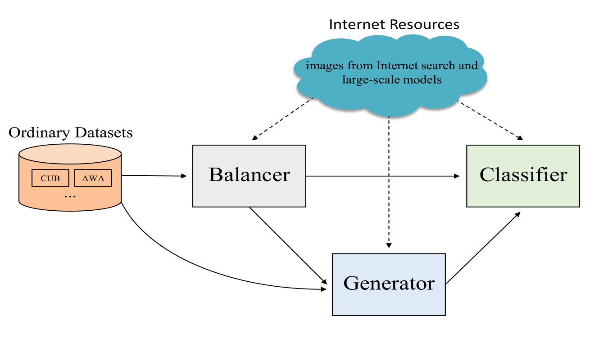

# BGF

## Introduce

This repository contains the official PyTorch implementation of "Real-World Classification Recognition with Limited Retrieved Images: A Novel Learning Paradigm and an Efficient Balanced Generative Framework".

Nowadays, people usually turn to the Internet or auxiliary online-tools based on  Visual Foundation Models when they recognize unfamiliar objects. The real-world classification recognition is being greatly affected by learning paradigms based on Internet resources. In this paper, we propose a novel learning paradigm, named Meta-Shot Learning (MSL), to reflect current human learning and recognition process in the Internet environment. Meta-Shot Learning could cover many existing learning paradigms, in which a learner could use auxiliary Internet resources to optimize recognition and inference through real-time Internet searching. Furthermore, we propose an efficient Balanced Generative Framework as an advanced baseline method, which works with the retrieved Internet images, to complete MSL classification task. The framework can adapt to and perform well in different limited data scenarios, including the resource-rich but noisy and the resource-scarce scenario with zero-shot learning. Experiments on several traditional datasets and the retrieved auxiliary images demonstrate that our framework has superior robustness in dealing with real-world classification recognition scenario and excellent performance in MSL classification task.



The specific model structure is shown in the following figure.


## Data

We release the training web images of CUB, FLO, SUN, AWA2 and APY at [Baidu Cloud](https://pan.baidu.com/s/1TXXqBjp3COd-d6X_7iBSxg) (access code: xjha) to support future comparison and analysis in Meta-Shot Learning research. The files in `./dataset` is as follows:

```angular2html
├── APY
  ├── APY_web
      ├── aeroplane
        ├── ……
      ├── ……
  ├── mat
      ├── APY_source_features.mat
      ├── APY_web_features.mat
      ├── att_splits.mat
  ├── meta
      ├── testclasses.txt
      ├── trainclasses.txt
  ├── origin
      ├── ayahoo_test_images
          ├── ……
      ├── images_att
          ├── VOCdevkit
              ├── ……
      ├── classes.txt
      ├── images.txt
      ├── predicate-matrix-continuous.txt
├── AWA2
├── CUB
├── FLO
```

## Install

Install dependencies using pip: `pip install -r requirements.txt`.

The proposed implementation is implemented in Python 3.10.9 and Pytorch 2.0.0, on Ubuntu 18.04 with an NVIDIA 3090 GPU.

## Train and Evaluate

Training consists of three stages:

1. Training ACSNet (Balancer)
```angular2html
python BGF-MSL/train_ACSNet.py \
--beta 0. \
--lr 5e-3 \
--domain_lr 5e-3 \
--batch_size 50 \
--lr_interval 25 \
--num_epoch 50 \
--head_type 4 \
--batch_class_num_B 2 \
--dim_att 64 \
--path_att_txt dataset/APY/origin/predicate-matrix-continuous.txt \
--data_path dataset/APY \
--cos_sim
```
2. Deriving weights
```angular2html
python ad_similarity/GAN_noise_detection.py \
--data_path dataset/APY \
--save_dir saves/APY_google \
--similarity_net saves/FolderOfACSNetTrainingResult/best.pth
```
3. Training of TF-VAEGAN (Generator) and Classifier is conducted, followed by evaluation.
```angular2html
python TFVAEGAN/train_images.py \
-dataset APY \
-strategy cosine_inter_expo3 \
-seen_weight_alpha_classifier 2 \
-aux_to_vae \
-n_aux_per_class 200 \
-web_weight_e 3.0
```
